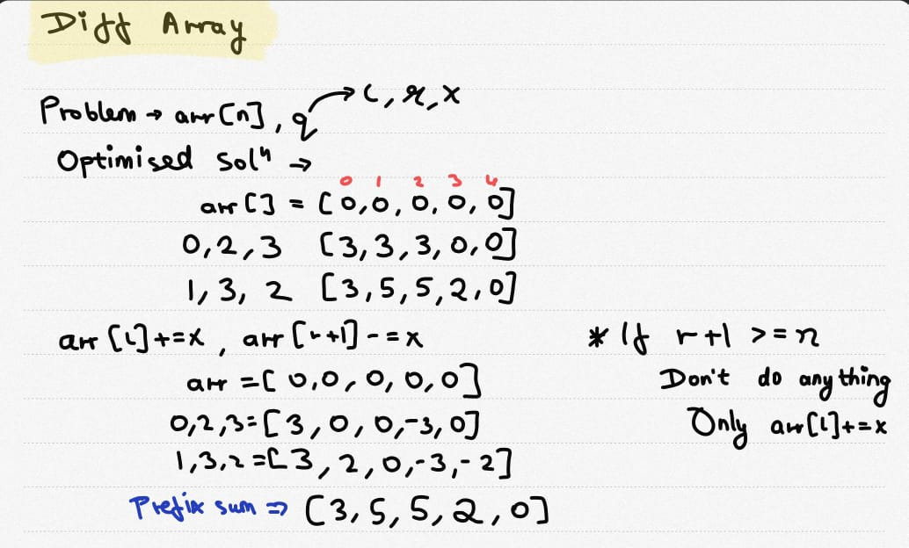

# **Difference Array and XOR Problem**

## **1. Difference Array Problem**

### **Problem Statement**  
Given an array of `n` elements and `q` queries, perform operations on the array based on the queries and print the final array.  

- **Constraints**:  
  - `1 ≤ n ≤ 10⁵`, `1 ≤ q ≤ 10⁵`  
  - Each query consists of:  
    - **L** (starting index)  
    - **R** (ending index)  
    - **X** (value to add)  
  - Add `X` to all elements in the range `[L, R]`.  

### **Naive Approach (O(n × q))**  
A direct approach iterates through the range `[L, R]` for every query, resulting in an inefficient `O(n × q)` complexity.

```cpp
void diffArray(int q, int arr[], int n) {
    for(int i = 0; i < q; i++) {
        int l, r, x;
        cin >> l >> r >> x;
        for(int j = l; j <= r; j++) {
            arr[j] += x;
        }
    }
}
```

### Time Complexity
TC-> O(n*q)



## Optimal Approach:
### Perform arr[l]+=xand arr[r+1]=-x
```cpp
for(int i=0;i<q;i++){
        cin>>l>>r>>x;
        arr[l]+=x; 
        if(r+1<n)
            arr[r+1]-=x;
}
// Prefix sum
for(int i=1;i<n;i++){
    arr[i]+=arr[i-1];
}
```

TC-> O(n+q)

---

### XOR Problem
**Problem** - Given an array of n elements and q queries are to be performed on it and print the array after performing all the queries
#### n<=10<sup>5</sup> & q<=10<sup>5</sup>

### Every Query contains of Lth index and Rth index such that perform XOR of X starting from L to R.

 ```
for(int i=0;i<q;i++){
        cin>>l>>r>>x;
        arr[l]|=x; 
        if(r+1<n)
            arr[r+1]|=x;
}
// Prefix XOR
for(int i=1;i<n;i++){
    arr[i]|=arr[i-1];
}
 ```