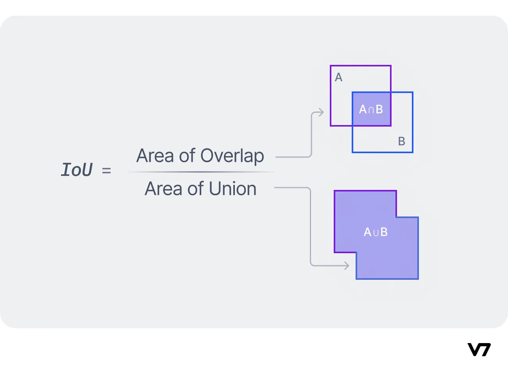
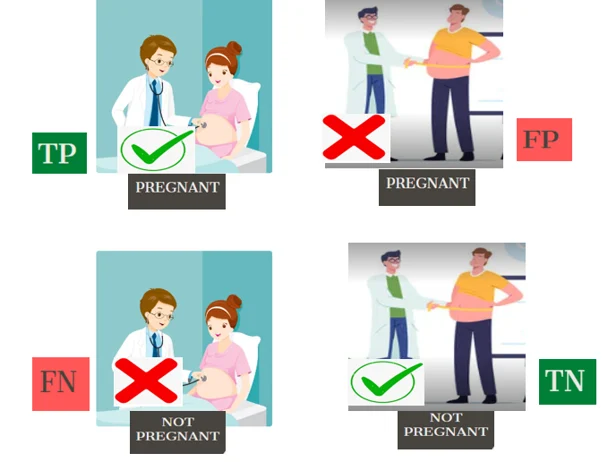
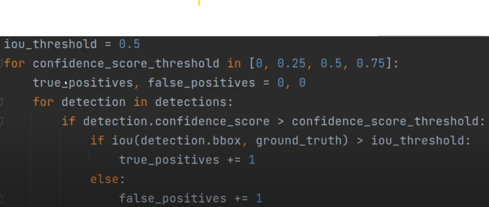

# Computer Vision

## What is Object Detection

- Computer Vision Technique to identify and locate objects in photos as well as videoes
- Technologies that perform object detection
    1. Python Library Mediapipe
    2. OpenCV
    3. Yolov8
    4. AWS Rekognition
- **Input**-> Image
- **Output**-> list of detected objects where prediction having
                1. Bounding Box \
                2. Confidence Score ranging from **(0 to 1)** \
                3. Object Category
                    [x1,y1,x2,y2,confidenceScore,className]

                Eg: [791,71,1719,1129,0.819,'cat']   

### Object Detection Metrics
*How to measure the performance of an Object Detection Model*
1. Firstly we combine the predictions with the ground truths

# RoadMap

**1. Fundamentals** \
**- Definitions** \
**- Examples** \
**- Ideal Conditions** \

**2. Advanced** \
**- Real Life Conditions** 

## Fundamentals

### 1. Most Common Metrics

#### Training
- **Loss Function**  
  - Related to the learning process.  
  - Different loss functions involve complex mathematical expressions.  
  - **Lower Loss is Better** ✅  

#### Evaluation Process
- **IoU (Intersection over Union)**  
  - Measures detection accuracy.  
  - Range: **(0,1)**  
  - **Higher is better** ✅  
  -   
  - Two key terms: **True Positive** (TP) and **False Positive** (FP). 
  
    A *True Positive* is when the model correctly predicts a pixel as being part of an object when it is actually part of the object. \
    A *False Positive* is when the model predicts a pixel as part of an object when it is part of the background.
    

- **mAP (Mean Average Precision)**
 - Based on precision-recall curve
 - Theprecision recall curve is based on IoU and detection confidence score
 - Recall measures how well we can find objects, whereas precision measures hwo well we perform after we find the object
 - Higher is better

 

**Precision** = $\frac{TruePositive}{TruePositive + FalsePostitive}$

**Recall** = $\frac{TruePositive}{}$

---

### 2. Assumptions for Perfect Training Data  
- **Many samples** ✅  
- **Equally distributed** ✅  
- **Perfectly annotated** ✅  
